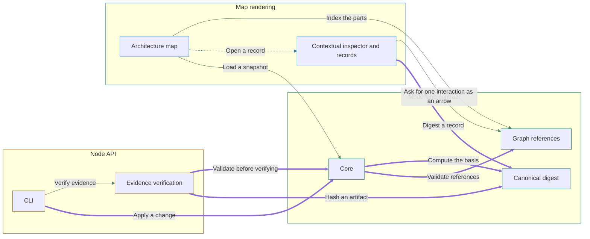

# Archivarius

One validated JSON file - a snapshot - holds a project's whole description as small linked records: its parts, the rules they must satisfy, the decisions behind them, the work left and the checks that confirm it. A React library draws that file as an architecture map that reveals more detail as it is zoomed.

## Quickstart

```sh
npm install archivarius
```

```js
import { mountArchitectureMap } from 'archivarius';
import 'archivarius/style.css';

const map = mountArchitectureMap(document.querySelector('#map'), {
  source: './architecture.json',
});
await map.ready;
```

A rejected model throws with a code: `INVALID_MODEL`.

Every code is in the Failure codes table the `reference` command writes.



## Component

| Component | Responsibility |
| --- | --- |
| Model and contract | Owns the v4 JSON schema, record types, graph references, revision provenance, snapshots and the validated-change contract; storage may be inline, adjacent archive segments or committed Git versions. |
| Core | Parses and validates a model, projects a v4 project to an architecture, and analyzes freshness and completion. |
| Graph references | Validates typed relations between records and reports reverse links and coverage. |
| Canonical digest | Computes the SHA-256 basis over a canonical representation of the definitions. |
| Node API | Reads model files and Git-backed history, verifies evidence, applies validated changes and generates documentation. |
| CLI | Exposes init, validate, read, context, apply, reference, readme, documents, graph, diff, history, verify, reconcile, run, archive and git-history over the model file. |
| Evidence verification | Matches declared binding bytes against files and records actual check outcomes. |
| Map rendering | Draws an interactive architecture map with confirmation, outstanding work and attention signals on its components; full records open on request. |
| Architecture map | Lays out components and interactions with semantic zoom. Legible cards name their kind, responsibility zone and confirmation state, show confirmed criteria and counted attention or work, and offer a one-click action to open contained parts. Edge labels name their interaction type or aggregate count. |
| Contextual inspector and records | Keeps a short component summary beside the diagram. Readers follow tasks and evidence without losing the map, and open full records, project lists or documents on request. |

<!-- Generated by Archivarius; edit the project JSON, not this file. -->
