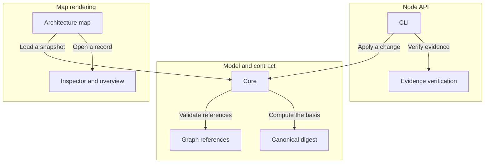

# Archivarius

A single validated JSON snapshot describes a project's architecture, requirements, decisions, scenarios, tasks and checks, and a React library renders it as an architecture map with semantic zoom.

An owner understands a system's structure, the grounds for decisions, the remaining work and the effect of changes from one snapshot; an LLM reads and edits the same records.

Revisions, used context and check results are distinct from ordinary references so that stale grounds and superseded evidence cannot pass as current confirmation.

<!-- Generated by Archivarius; edit the project JSON, not this file. -->
