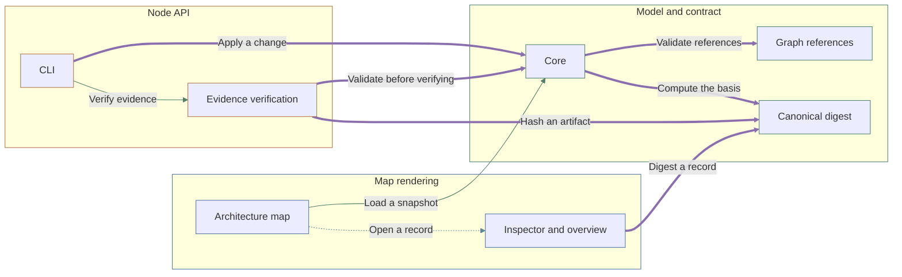

# Archivarius

One validated JSON file - a snapshot - holds a project's whole description as small linked records: its parts, the rules they must satisfy, the decisions behind them, the work left and the checks that confirm it. A React library draws that file as an architecture map that reveals more detail as it is zoomed.

## Quickstart

```sh
npm install archivarius
```

```js
import { mountArchitectureMap } from 'archivarius';
import 'archivarius/style.css';

const map = mountArchitectureMap(document.querySelector('#map'), {
  source: './architecture.json',
});
await map.ready;
```

A rejected model throws with a code: `INVALID_MODEL`.

Every code is in the Failure codes table the `reference` command writes.

An owner understands a system's structure, the grounds for decisions, the remaining work and the effect of changes from one snapshot; an LLM reads and edits the same records.

The snapshot in this repository describes Archivarius itself, so the map below, the tables under it and this page are the project's own records drawn by the library it documents.

A record keeps the definitions it was written against apart from the records it merely mentions, so when a definition changes, whatever rested on it stops counting as confirmed instead of quietly staying green.

A team installs the library, mounts a map of its own system, and needs to find how to install it, how to read a failure and what it may rely on across versions.

A reader arrives with a keyboard, a screen reader, a text size, a motion preference and a colour perception the library does not choose, and a link is how a finding is passed to somebody else.

A described system reaches hundreds of parts, layout runs on the same thread as the interface, and every part stays mounted whether it is visible or not.

A digest proves a file has not moved, not that the file still does what a record claims, so a description can stay confirmed while the code it describes contradicts it.

Furnas, Generalized Fisheye Views, CHI 1986 (https://doi.org/10.1145/22627.22342): a display that holds full detail near the point of interest and degrades it with distance shows a structure larger than the screen, so how much detail a part gets is a function of interest rather than a separate view the reader has to open.

Perlin and Fox, Pad, SIGGRAPH 1993 (https://doi.org/10.1145/166117.166125), and Bederson and Hollan, Pad++, UIST 1994 (https://doi.org/10.1145/192426.192435): on one continuous zoomable surface an object may change its representation at a size threshold - semantic zoom - which replaces a stack of separate diagrams with a single space.

Cockburn, Karlson and Bederson, A Review of Overview+Detail, Zooming, and Focus+Context Interfaces, ACM Computing Surveys 2009 (https://doi.org/10.1145/1456650.1456652): pure zooming costs the reader the surrounding context and the memory of where they were, so a zoomable map owes them an overview and a way back to a named position.

Shneiderman, The Eyes Have It, IEEE Symposium on Visual Languages 1996 (https://doi.org/10.1109/VL.1996.545307): overview first, zoom and filter, details on demand, then relate, history and extract - seven tasks, and a viewer that omits one of them leaves the reader without a move.

Moody, The Physics of Notations, IEEE Transactions on Software Engineering 2009 (https://doi.org/10.1109/TSE.2009.67): a visual notation is judged by perceptual discriminability, dual coding and one symbol per concept, so shape, outline and tone must carry a meaning together instead of colour carrying it alone.

Cleveland and McGill, Graphical Perception, Journal of the American Statistical Association 1984 (https://doi.org/10.1080/01621459.1984.10478080): position and length are decoded more accurately than area or colour, so anything a reader must compare belongs in geometry and colour stays a label.

Petre, Why Looking Isn't Always Seeing, Communications of the ACM 1995 (https://doi.org/10.1145/203241.203251): arrangement carries meaning the notation never states and only a practised reader sees it, so a generated picture must not let accidental placement stand in for a stated fact.

Sugiyama, Tagawa and Toda, Methods for Visual Understanding of Hierarchical System Structures, IEEE Transactions on Systems, Man, and Cybernetics 1981 (https://doi.org/10.1109/TSMC.1981.4308636), shipped as the layered algorithm this library asks ELK for (https://eclipse.dev/elk/reference/algorithms/org-eclipse-elk-layered.html): layer assignment, crossing reduction and straightening make a dependency graph readable without anybody placing a box by hand.

Card, Robertson and Mackinlay, The Information Visualizer, CHI 1991 (https://doi.org/10.1145/108844.108874): 0.1 second reads as a direct response, 1 second keeps a train of thought unbroken and 10 seconds is the limit of held attention - the budgets any layout sharing the interface thread has to fit.

Kruchten, The 4+1 View Model of Architecture, IEEE Software 1995 (https://doi.org/10.1109/52.469759): one architecture is described by several views written for different concerns, so several documents rendered from one snapshot answer more than a single diagram trying to answer everything.

Parnas, On the Criteria to Be Used in Decomposing Systems into Modules, Communications of the ACM 1972 (https://doi.org/10.1145/361598.361623): a module exists to hide a decision behind its interface, which makes a layer table and a one-way import rule part of the description of the design rather than a lint preference.

Meyer, Applying 'Design by Contract', IEEE Computer 1992 (https://doi.org/10.1109/2.161279): a component states its precondition, so a caller that violates one can be told which obligation it missed instead of receiving an anonymous failure.

W3C, Web Content Accessibility Guidelines 2.2 (https://www.w3.org/TR/WCAG22/), with the ARIA Authoring Practices Guide (https://www.w3.org/WAI/ARIA/apg/): keyboard operation, a cue that is not colour alone, contrast, reflow, a respected motion preference and an announced status change are numbered success criteria and named widget patterns, not matters of taste.

Nielsen, 10 Usability Heuristics for User Interface Design (https://www.nngroup.com/articles/ten-usability-heuristics/): visibility of system status, user control, and error messages that state the problem in plain language and suggest a remedy.

JSON Schema 2020-12 (https://json-schema.org/draft/2020-12/json-schema-core) and Semantic Versioning 2.0.0 (https://semver.org/spec/v2.0.0.html): the contract is declared in a dated dialect and every change to it is graded, so a consumer can tell an addition from a removal before upgrading.

Brown, the C4 model for visualising software architecture (https://c4model.com/): context, container, component and code are levels of one description with different audiences, which is what a zoom threshold has to correspond to if the map is to replace them.



| Scenario | Actor | Preconditions | Actions | Failure and recovery |
| --- | --- | --- | --- | --- |
| Edit a definition and re-render | LLM agent | A validated snapshot is loaded. | Read a focused record's context.<br>Apply a validated change against the unchanged context.<br>Re-validate the whole snapshot.<br>Re-render the map and inspector. | A stale context is rejected and the model is preserved.<br>A broken reference fails validation. |
| Read a system nobody explained | An owner new to the system | A validated snapshot of a system with more parts than fit on one screen is mounted. | Read the overview and the stated level.<br>Search for a part by name.<br>Zoom it past its threshold until its children appear in place.<br>Follow one relation to a neighbour and read the closure of what a change to it reaches.<br>Copy the address and open it again in a new tab. | A name that matches nothing states so instead of clearing the map.<br>An address naming an absent record is refused with a stated failure. |
| Read the map with a keyboard and a screen reader | A reader using a keyboard, a screen reader and a reduced-motion setting | A validated snapshot is mounted in a browser with the reader’s own settings. | Reach the map by tab and traverse it by arrow key.<br>Select a part and read the panel.<br>Change the level and hear what changed.<br>Enlarge the text until the page reflows to one column. | A part reachable by pointer but not by key fails the run. |
| Install it and mount a first map | A consuming team | Only the published package and its generated documentation are available. | Follow the shipped page to install the package.<br>Write a first snapshot from the starting template.<br>Mount the map in an application and feed it that snapshot.<br>Break the snapshot on purpose and read the failure.<br>Upgrade to the next version and read what the version promised. | An input past the stated bounds is rejected by name, not by exhaustion.<br>A snapshot from a newer major contract is refused with the grade of the difference. |
| Confirm, withdraw and compare | An owner auditing the description | A snapshot with recorded outcomes and bound parts is loaded. | Run a check and store its output as evidence.<br>Change one definition and read what lost its basis and why.<br>Read the described part against the file it binds to.<br>Compare the snapshot with the previous release.<br>Export the result for a tool outside the library. | An outcome with no recorded run is refused.<br>Moved bytes ask for a reading instead of staying confirmed. |
| Regenerate every document | An LLM agent | A validated snapshot and the committed generated documents are present. | Regenerate the landing page, the reference and every diagram.<br>Parse each diagram with the renderer that will draw it.<br>Compare the result with the committed files.<br>Confirm a record carrying markup is drawn as text. | Any drift between the model and a committed document fails the run. |

| Component | Responsibility |
| --- | --- |
| Model and contract | Owns the v4 JSON schema, record types, graph references, history, snapshots and the validated-change contract. |
| Core | Parses and validates a model, projects a v4 project to an architecture, and analyzes freshness and completion. |
| Graph references | Validates typed relations between records and reports reverse links and coverage. |
| Canonical digest | Computes the SHA-256 basis over a canonical representation of the definitions. |
| Node API | Reads a model file, verifies evidence artifacts by bytes, applies validated changes, and generates documentation. |
| CLI | Exposes init, validate, read, context, apply, reference, readme, documents, graph, diff, history, verify, reconcile, run and archive over the model file. |
| Evidence verification | Matches declared binding bytes against files and records actual check outcomes. |
| Map rendering | Mounts an interactive architecture map with semantic zoom and an inspector for records. |
| Architecture map | Lays out components and interactions and reveals detail as the map is zoomed. |
| Inspector and overview | Shows a record's meaning, links, implementation outcome and the reasons requiring attention. |

| Interaction contract | Payload | Meaning |
| --- | --- | --- |
| Load a snapshot | A v4 JSON snapshot as a URL, File, Blob or parsed object. | Any accepted source resolves to one parsed snapshot before anything renders, and a snapshot that fails validation is never partly displayed. |
| Validate references | The typed relations between records. | Every relation resolves to an existing record of a type its field allows, and whatever nothing points at is reported as uncovered. |
| Compute the basis | The canonical definitions and their SHA-256 basis. | Equal definitions yield an equal basis whatever their order or edit history, so a differing basis means a definition really changed. |
| Open a record | A selected record with its links and implementation outcome. | A record arrives with its links and outcome already resolved, so what is shown never depends on a second read of the model. |
| Apply a change | A context receipt and a change with put and remove sets. | The receipt fixes the definitions the change was written against, so a change computed from definitions that have since moved cannot land. |
| Verify evidence | Relative binding paths and the bytes they resolve to. | A declared path confirms only while its bytes still match, so an artifact that was moved or edited stops confirming on the next read. |
| Hash an artifact | The canonical definitions and their SHA-256 basis. | Equal definitions yield an equal basis whatever their order or edit history, so a differing basis means a definition really changed. |
| Digest a record | The canonical definitions and their SHA-256 basis. | Equal definitions yield an equal basis whatever their order or edit history, so a differing basis means a definition really changed. |
| Validate before verifying | A v4 JSON snapshot as a URL, File, Blob or parsed object. | Any accepted source resolves to one parsed snapshot before anything renders, and a snapshot that fails validation is never partly displayed. |

| Requirement | Rule | Conditions | Exceptions |
| --- | --- | --- | --- |
| One snapshot, one set of definitions | Every statement has a single definition; all views render the one selected snapshot. | A model is loaded or rendered. |  |
| Changes are validated against an unchanged context | A change requires an unchanged context receipt; a stale context, unknown field or broken reference is rejected and the source file is preserved. | A change is applied through the API or CLI. |  |
| Confirmation needs byte-exact evidence | A check outcome confirms only with an available execution artifact and matching bytes for every declared input; missing or stale evidence does not confirm. | An implementation outcome is derived. |  |
| Conservative freshness | Changing any definition conservatively marks dependent decisions, tasks and checks as requiring review; the current review scope is the whole project. | A definition changes. |  |
| Detail arrives by zooming | Zooming a container past its legibility threshold reveals its children in place and zooming out returns them to one card; no separate drill-down step is required. | A container box crosses the expansion threshold. | A container with no children never expands. |
| A view can be handed to somebody else | Every view a reader reaches - focus, expansion, open panel - is addressable by a link that restores it, and the same view leaves as an image without a screenshot tool. | A reader shares what they are looking at. |  |
| Everything reachable by pointer is reachable by key | Every action a pointer can take a keyboard can take: one tab stop per region, traversal between parts and their relations inside the map, and focus returned to the control that opened a panel. | A reader navigates without a pointer. |  |
| A change the reader did not type is announced | A change the reader did not type - zoom, expansion, focus, a panel opening or closing, a load failing - is announced to assistive technology. | The view changes without a keystroke that caused it directly. |  |
| The reader owns motion, contrast, scheme and text size | The map honours the reader motion, contrast, colour-scheme and text-size settings, and no fact is carried by colour alone. | The map is rendered. |  |
| A failure can be caught and understood | Every failure the library raises carries a stable code, that code is listed in a shipped table with its cause and its remedy, and the declared type enumerates the codes instead of naming a bare string. | The library refuses to load, validate, apply or render. |  |
| A consumer starts from the shipped documentation | A consumer can install the package, mount a map, style it and validate a model from the shipped documentation alone, without reading the source. | A consumer adopts the library. |  |
| What a version promises is written down | The package states its license, records every release in a changelog, and says which contract versions a package version accepts and what a contract change costs a consumer. | A version is published. |  |
| A large model stays interactive | Layout and geometry run off the interface thread, only visible parts are mounted, and a model of the stated size reaches first paint and stays interactive within the stated budget. | A model larger than one screen is loaded. |  |
| Every read is bounded and cancellable | Every read bounds what it accepts - a size limit on input, a timeout on layout, a cap on concurrent artifact reads - and every bound is reported as a coded failure rather than a hang. | Input is read from a file, a URL or a caller. |  |
| Authoring starts from something valid | A new project starts from a generated skeleton, every record type has a template, a change can be rehearsed without writing, and every diagnostic names the field and the fix. | A project is created or edited. |  |
| A claim binds to what it rests on | A claim binds to the parts of the code it rests on - several files, and a range within a file - so an unrelated edit does not withdraw the confirmation. | A record is bound to code. |  |
| Withdrawal follows dependency | A definition change withdraws confirmation from the records that depend on it, and a review confirms a subtree without re-reading the whole project. | A definition changes. |  |
| Two snapshots can be compared | Two snapshots of one project can be compared: what was added, removed, re-zoned, re-parented, re-confirmed or withdrawn, as a report and on the map. | A snapshot is compared with an earlier one. |  |
| A description is reconciled with the code | A described relation is reconciled against the dependency the code actually has: a declared edge that no longer exists and an existing edge nobody declared are both reported. | Evidence is verified. |  |
| A claim can be aged and questioned | Every record states when it was last changed and by whom or what, so a claim can be aged, attributed and questioned. | A record is written. |  |
| An outcome comes from running something | A check declares the command that proves it, an outcome is written only by running that command, and a hand-written pass is refused. | A check outcome is recorded. |  |
| Model content is inert | Model content renders as literal text: no executable markup, no active-content links, and no request outside the declared model and asset reads. | Model content is rendered. |  |
| Imports point down one table | Imports point down one layer table and never form a cycle, and the browser surface performs no file or network access outside its single loader. | A module is added or moved. |  |
| Every document is generated | Every shipped document is generated from the snapshot and regenerating it in place is a no-op; drift fails the check instead of being repaired by hand. | A document is generated or checked. |  |
| English is the only language | The library ships English copy only: no locale parameter, no translation table beyond the shipped copy, and the mounted subtree states its language. | Copy is read or rendered. |  |
| A snapshot can leave the library | A snapshot leaves the library as a standalone diagram, a self-contained page and an image, each generated from the same projection the map draws. | A snapshot is published outside the map. |  |
| A part can be found by name | A reader finds a part by name from the map itself and the map moves to it, and a filter hides what is out of scope rather than only dimming it. | A reader looks for a part. |  |
| The map answers where an effect reaches | The map answers where the effects of a part reach: the path between two parts, the transitive dependents of one, and the cycles between them. | A reader asks what a change touches. |  |
| No fact is carried by colour alone | Every distinction the map or a generated diagram draws - zone, kind, interaction, selection, staleness - is carried by at least two of tone, shape, outline, line and text, and the text form alone is enough to read it. | A node, a relation or a state is drawn in the map or in a generated diagram. | A purely decorative surface that states no model fact. |

| Decision | Choice | Rationale | Consequences |
| --- | --- | --- | --- |
| Canonical digest for the basis | Compute basis.contract as a SHA-256 over a canonical representation of the definitions, excluding results, history and review text. | A content digest detects real definition changes without trusting order or edit metadata. | Any definition change, including additions, drops the current basis. |
| Project data and copy stay external | Load model data and UI copy as external resources rather than bundling them into the library. | The format stays independent of any project, repository or build, and shipped scripts do not carry project data. | A consumer supplies the model source and container. |
| One appearance table for every picture | Derive how a node and a relation are drawn - tone, shape, outline and line - from one table keyed on the rendering contract's closed enums, and read that table from both the map and the generated diagram; a renderer adds only its own pixels. | A second palette drifts, so the same zone or interaction kind would read differently in the map than in the generated documentation, and a value the contract allows could reach a renderer with no display token at all. | A value added to a contract enum fails the appearance suite until it is given a token.<br>The table carries tones, shapes, outlines and lines; a fill, a text colour, a dash length and a radius stay with the surface that draws them, so the generated diagram leaves both to the reader theme.<br>The container sequence that tells one root from another shares no tone with the zones, so an edge colour never reads as a zone the node is not in. |
| Ask for a layered graph rather than place boxes | Compute geometry with the ELK layered algorithm - the Sugiyama pipeline - loaded on demand, and treat its output as the only source of position and size. | A dependency graph read top to bottom needs layer assignment and crossing reduction, both solved by a stated algorithm, and hand-placed coordinates would make arrangement a fact nobody validates. | Layout cost grows with the model, so it has to move off the interface thread to keep the response budget.<br>A reader cannot nudge a box; a bad reading is fixed by changing the model or the layout options. |

<!-- Generated by Archivarius; edit the project JSON, not this file. -->
