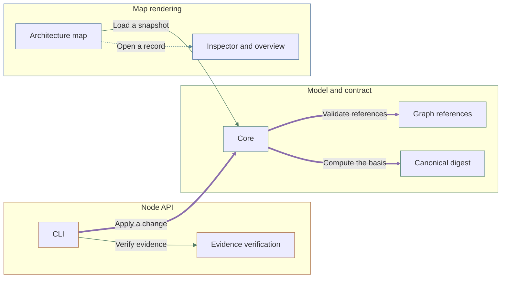

# Archivarius

One validated JSON file - a snapshot - holds a project's whole description as small linked records: its parts, the rules they must satisfy, the decisions behind them, the work left and the checks that confirm it. A React library draws that file as an architecture map that reveals more detail as it is zoomed.

An owner understands a system's structure, the grounds for decisions, the remaining work and the effect of changes from one snapshot; an LLM reads and edits the same records.

The snapshot in this repository describes Archivarius itself, so the map below, the tables under it and this page are the project's own records drawn by the library it documents.

A record keeps the definitions it was written against apart from the records it merely mentions, so when a definition changes, whatever rested on it stops counting as confirmed instead of quietly staying green.

| Scenario | Actor | Preconditions | Actions | Failure and recovery |
| --- | --- | --- | --- | --- |
| Edit a definition and re-render | LLM agent | A validated snapshot is loaded. | Read a focused record's context. Apply a validated change against the unchanged context. Re-validate the whole snapshot. Re-render the map and inspector. | A stale context is rejected and the model is preserved. A broken reference fails validation. |

| Component | Responsibility |
| --- | --- |
| Model and contract | Owns the v4 JSON schema, record types, graph references, history, snapshots and the validated-change contract. |
| Core | Parses and validates a model, projects a v4 project to an architecture, and analyzes freshness and completion. |
| Graph references | Validates typed relations between records and reports reverse links and coverage. |
| Canonical digest | Computes the SHA-256 basis over a canonical representation of the definitions. |
| Node API | Reads a model file, verifies evidence artifacts by bytes, applies validated changes, and generates documentation. |
| CLI | Exposes validate, read, context, apply, reference, readme, documents, verify, run and archive over the model file. |
| Evidence verification | Matches declared binding bytes against files and records actual check outcomes. |
| Map rendering | Mounts an interactive architecture map with semantic zoom and an inspector for records. |
| Architecture map | Lays out components and interactions and reveals detail as the map is zoomed. |
| Inspector and overview | Shows a record's meaning, links, implementation outcome and the reasons requiring attention. |

| Interaction contract | Payload | Meaning |
| --- | --- | --- |
| Load a snapshot | A v4 JSON snapshot as a URL, File, Blob or parsed object. | Any accepted source resolves to one parsed snapshot before anything renders, and a snapshot that fails validation is never partly displayed. |
| Validate references | The typed relations between records. | Every relation resolves to an existing record of a type its field allows, and whatever nothing points at is reported as uncovered. |
| Compute the basis | The canonical definitions and their SHA-256 basis. | Equal definitions yield an equal basis whatever their order or edit history, so a differing basis means a definition really changed. |
| Open a record | A selected record with its links and implementation outcome. | A record arrives with its links and outcome already resolved, so what is shown never depends on a second read of the model. |
| Apply a change | A context receipt and a change with put and remove sets. | The receipt fixes the definitions the change was written against, so a change computed from definitions that have since moved cannot land. |
| Verify evidence | Relative binding paths and the bytes they resolve to. | A declared path confirms only while its bytes still match, so an artifact that was moved or edited stops confirming on the next read. |

| Requirement | Rule | Conditions |
| --- | --- | --- |
| One snapshot, one set of definitions | Every statement has a single definition; all views render the one selected snapshot. | A model is loaded or rendered. |
| Changes are validated against an unchanged context | A change requires an unchanged context receipt; a stale context, unknown field or broken reference is rejected and the source file is preserved. | A change is applied through the API or CLI. |
| Confirmation needs byte-exact evidence | A check outcome confirms only with an available execution artifact and matching bytes for every declared input; missing or stale evidence does not confirm. | An implementation outcome is derived. |
| Conservative freshness | Changing any definition conservatively marks dependent decisions, tasks and checks as requiring review; the current review scope is the whole project. | A definition changes. |

| Decision | Choice | Rationale | Consequences |
| --- | --- | --- | --- |
| Canonical digest for the basis | Compute basis.contract as a SHA-256 over a canonical representation of the definitions, excluding results, history and review text. | A content digest detects real definition changes without trusting order or edit metadata. | Any definition change, including additions, drops the current basis. |
| Project data and copy stay external | Load model data and UI copy as external resources rather than bundling them into the library. | The format stays independent of any project, repository or build, and shipped scripts do not carry project data. | A consumer supplies the model source and container. |
| One appearance table for every picture | Derive how a node and a relation are drawn - tone, shape, outline and line - from one table keyed on the rendering contract's closed enums, and read that table from both the map and the generated diagram; a renderer adds only its own pixels. | A second palette drifts, so the same zone or interaction kind would read differently in the map than in the generated documentation, and a value the contract allows could reach a renderer with no display token at all. | A value added to a contract enum fails the appearance suite until it is given a token. The table carries tones, shapes, outlines and lines; a fill, a text colour, a dash length and a radius stay with the surface that draws them, so the generated diagram leaves both to the reader theme. The container sequence that tells one root from another shares no tone with the zones, so an edge colour never reads as a zone the node is not in. |

<!-- Generated by Archivarius; edit the project JSON, not this file. -->
