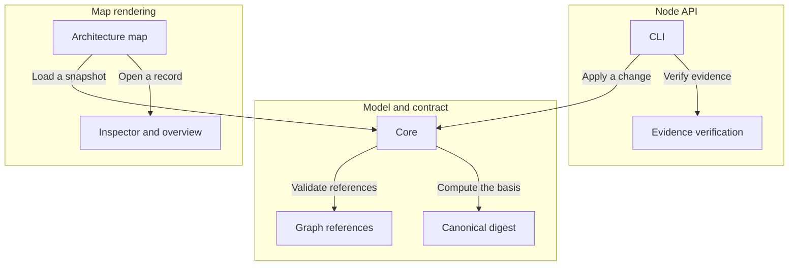

# Archivarius

A single validated JSON snapshot describes a project's architecture, requirements, decisions, scenarios, tasks and checks, and a React library renders it as an architecture map with semantic zoom.

An owner understands a system's structure, the grounds for decisions, the remaining work and the effect of changes from one snapshot; an LLM reads and edits the same records.

Revisions, used context and check results are distinct from ordinary references so that stale grounds and superseded evidence cannot pass as current confirmation.

| Component | Responsibility |
| --- | --- |
| Model and contract | Owns the v4 JSON schema, record types, graph references, history, snapshots and the validated-change contract. |
| Core | Parses and validates a model, projects a v4 project to an architecture, and analyzes freshness and completion. |
| Graph references | Validates typed relations between records and reports reverse links and coverage. |
| Canonical digest | Computes the SHA-256 basis over a canonical representation of the definitions. |
| Node API | Reads a model file, verifies evidence artifacts by bytes, applies validated changes, and generates documentation. |
| CLI | Exposes validate, read, context, apply, documents, verify, run and archive over the model file. |
| Evidence verification | Matches declared binding bytes against files and records actual check outcomes. |
| Map rendering | Mounts an interactive architecture map with semantic zoom and an inspector for records. |
| Architecture map | Lays out components and interactions and reveals detail as the map is zoomed. |
| Inspector and overview | Shows a record's meaning, links, implementation outcome and the reasons requiring attention. |

| Interaction contract | Payload | Meaning |
| --- | --- | --- |
| Load a snapshot | A v4 JSON snapshot as a URL, File, Blob or parsed object. | Any accepted source resolves to one parsed snapshot before anything renders, and a snapshot that fails validation is never partly displayed. |
| Validate references | The typed relations between records. | Every relation resolves to an existing record of a type its field allows, and whatever nothing points at is reported as uncovered. |
| Compute the basis | The canonical definitions and their SHA-256 basis. | Equal definitions yield an equal basis whatever their order or edit history, so a differing basis means a definition really changed. |
| Open a record | A selected record with its links and implementation outcome. | A record arrives with its links and outcome already resolved, so what is shown never depends on a second read of the model. |
| Apply a change | A context receipt and a change with put and remove sets. | The receipt fixes the definitions the change was written against, so a change computed from definitions that have since moved cannot land. |
| Verify evidence | Relative binding paths and the bytes they resolve to. | A declared path confirms only while its bytes still match, so an artifact that was moved or edited stops confirming on the next read. |

| Requirement | Rule | Conditions |
| --- | --- | --- |
| One snapshot, one set of definitions | Every statement has a single definition; all views render the one selected snapshot. | A model is loaded or rendered. |
| Changes are validated against an unchanged context | A change requires an unchanged context receipt; a stale context, unknown field or broken reference is rejected and the source file is preserved. | A change is applied through the API or CLI. |
| Confirmation needs byte-exact evidence | A check outcome confirms only with an available execution artifact and matching bytes for every declared input; missing or stale evidence does not confirm. | An implementation outcome is derived. |
| Conservative freshness | Changing any definition conservatively marks dependent decisions, tasks and checks as requiring review; the current review scope is the whole project. | A definition changes. |

| Decision | Choice | Rationale | Consequences |
| --- | --- | --- | --- |
| Canonical digest for the basis | Compute basis.contract as a SHA-256 over a canonical representation of the definitions, excluding results, history and review text. | A content digest detects real definition changes without trusting order or edit metadata. | Any definition change, including additions, drops the current basis. |
| Project data and copy stay external | Load model data and UI copy as external resources rather than bundling them into the library. | The format stays independent of any project, repository or build, and shipped scripts do not carry project data. | A consumer supplies the model source and container. |

<!-- Generated by Archivarius; edit the project JSON, not this file. -->
