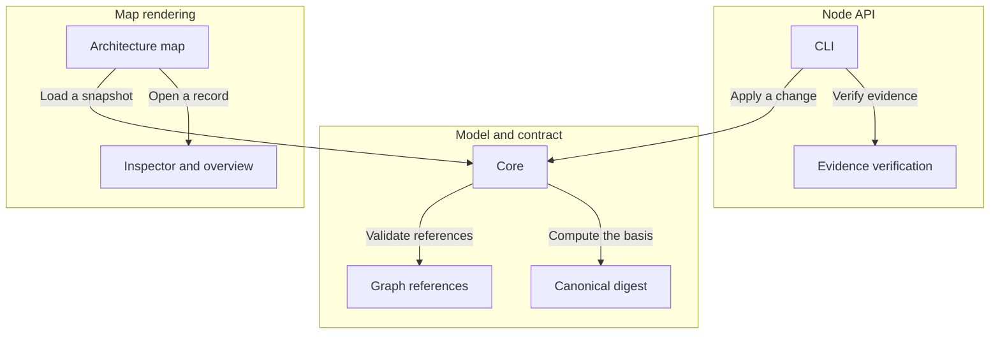

# Archivarius

A single validated JSON snapshot describes a project's architecture, requirements, decisions, scenarios, tasks and checks, and a React library renders it as an architecture map with semantic zoom.

An owner understands a system's structure, the grounds for decisions, the remaining work and the effect of changes from one snapshot; an LLM reads and edits the same records.

Revisions, used context and check results are distinct from ordinary references so that stale grounds and superseded evidence cannot pass as current confirmation.

| | |
| --- | --- |
| Core | Parses and validates a model, projects a v4 project to an architecture, and analyzes freshness and completion. Layout and rendering stay outside the core. |
| Graph references | Validates typed relations between records and reports reverse links and coverage. Reference semantics are fixed by the schema targets. |
| Canonical digest | Computes the SHA-256 basis over a canonical representation of the definitions. The canonicalization rules are internal to the digest. |
| CLI | Exposes validate, read, context, apply, documents, verify, run and archive over the model file. Argument parsing and file paths stay inside the CLI. |
| Evidence verification | Matches declared binding bytes against files and records actual check outcomes. Executing checks is performed by the run command, not by loading a model. |
| Architecture map | Lays out components and interactions and reveals detail as the map is zoomed. Layout geometry stays inside the map. |
| Inspector and overview | Shows a record's meaning, links, implementation outcome and the reasons requiring attention. Project data and UI copy stay external resources. |

| | |
| --- | --- |
| Load a snapshot | A v4 JSON snapshot as a URL, File, Blob or parsed object. The rendering subsystem loads a snapshot to display. |
| Validate references | The typed relations between records. The core asks the graph to validate references and report coverage. |
| Compute the basis | The canonical definitions and their SHA-256 basis. The core asks the digest for the freshness basis. |
| Open a record | A selected record with its links and implementation outcome. The map opens a record in the inspector. |
| Apply a change | A context receipt and a change with put and remove sets. The node API applies a validated change against an unchanged context. |
| Verify evidence | Relative binding paths and the bytes they resolve to. Evidence verification compares declared inputs against actual files. |

<!-- Generated by Archivarius; edit the project JSON, not this file. -->
