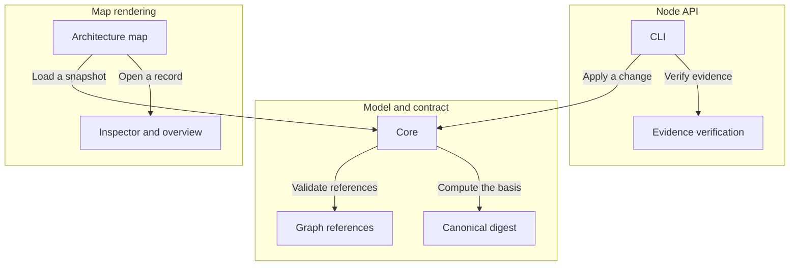

# Archivarius

A single validated JSON snapshot describes a project's architecture, requirements, decisions, scenarios, tasks and checks, and a React library renders it as an architecture map with semantic zoom.

An owner understands a system's structure, the grounds for decisions, the remaining work and the effect of changes from one snapshot; an LLM reads and edits the same records.

Revisions, used context and check results are distinct from ordinary references so that stale grounds and superseded evidence cannot pass as current confirmation.

Criteria confirmed: 0 of 4

The outcome accounts for applicable requirements, contained parts and explicit dependencies. Confirmed criteria describe verified behavior, not a completion percentage. Missing confirmation does not mean missing code.

| Component | Responsibility | Detail boundary |
| --- | --- | --- |
| Model and contract | Owns the v4 JSON schema, record types, graph references, history, snapshots and the validated-change contract. |  |
| Core | Parses and validates a model, projects a v4 project to an architecture, and analyzes freshness and completion. | Layout and rendering stay outside the core. |
| Graph references | Validates typed relations between records and reports reverse links and coverage. | Reference semantics are fixed by the schema targets. |
| Canonical digest | Computes the SHA-256 basis over a canonical representation of the definitions. | The canonicalization rules are internal to the digest. |
| Node API | Reads a model file, verifies evidence artifacts by bytes, applies validated changes, and generates documentation. |  |
| CLI | Exposes validate, read, context, apply, documents, verify, run and archive over the model file. | Argument parsing and file paths stay inside the CLI. |
| Evidence verification | Matches declared binding bytes against files and records actual check outcomes. | Executing checks is performed by the run command, not by loading a model. |
| Map rendering | Mounts an interactive architecture map with semantic zoom and an inspector for records. |  |
| Architecture map | Lays out components and interactions and reveals detail as the map is zoomed. | Layout geometry stays inside the map. |
| Inspector and overview | Shows a record's meaning, links, implementation outcome and the reasons requiring attention. | Project data and UI copy stay external resources. |

| Interaction contract | Payload | Meaning |
| --- | --- | --- |
| Load a snapshot | A v4 JSON snapshot as a URL, File, Blob or parsed object. | The rendering subsystem loads a snapshot to display. |
| Validate references | The typed relations between records. | The core asks the graph to validate references and report coverage. |
| Compute the basis | The canonical definitions and their SHA-256 basis. | The core asks the digest for the freshness basis. |
| Open a record | A selected record with its links and implementation outcome. | The map opens a record in the inspector. |
| Apply a change | A context receipt and a change with put and remove sets. | The node API applies a validated change against an unchanged context. |
| Verify evidence | Relative binding paths and the bytes they resolve to. | Evidence verification compares declared inputs against actual files. |

| Requirement | Rule | Conditions | Confirmed behavior |
| --- | --- | --- | --- |
| One snapshot, one set of definitions | Every statement has a single definition; all views render the one selected snapshot. | A model is loaded or rendered. | No |
| Changes are validated against an unchanged context | A change requires an unchanged context receipt; a stale context, unknown field or broken reference is rejected and the source file is preserved. | A change is applied through the API or CLI. | No |
| Confirmation needs byte-exact evidence | A check outcome confirms only with an available execution artifact and matching bytes for every declared input; missing or stale evidence does not confirm. | An implementation outcome is derived. | No |
| Conservative freshness | Changing any definition conservatively marks dependent decisions, tasks and checks as requiring review; the current review scope is the whole project. | A definition changes. | No |

| Decision | Choice | Alternatives | Rationale | Consequences |
| --- | --- | --- | --- | --- |
| Canonical digest for the basis | Compute basis.contract as a SHA-256 over a canonical representation of the definitions, excluding results, history and review text. | Track freshness by timestamps or manual review flags. | A content digest detects real definition changes without trusting order or edit metadata. | Any definition change, including additions, drops the current basis. |
| Project data and copy stay external | Load model data and UI copy as external resources rather than bundling them into the library. | Embed a default model and copy in the shipped scripts. | The format stays independent of any project, repository or build, and shipped scripts do not carry project data. | A consumer supplies the model source and container. |

| Why confirmation is missing |
| --- |
| No accessible realization binding |
| No integrated outcome confirmation |
| Basis has not been recorded |
| An open question or assumption remains |
| No accessible current check evidence |
| Scenario has no verified check |

<!-- Generated by Archivarius; edit the project JSON, not this file. -->
