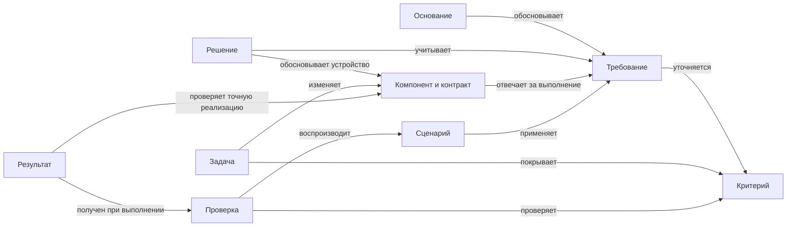

# Единая модель проекта: содержание, происхождение и актуальность

Это описание согласованной продуктовой модели Archivarius.
Оно объединяет согласованную цель, необходимые следствия и разбор сценариев.
Формат и границы проверок определены в [контракте v4](../../assets/contract.md).

## Цель и граница обещания

Владелец проекта быстро понимает устройство, основания решений, оставшуюся работу
и последствия изменений через карту. LLM изучает проект, редактирует первичные
артефакты, выполняет инженерную работу и разбирает выявленные несоответствия.
Просмотр карты не требует чтения всего корпуса или запоминания ключей.

Согласованный охват: требования, критерии, решения, архитектура, сценарии, задачи
и проверки. Формат данных — JSON; схема ограничивает структуру, дополнительные
правила проверяют связи и применимость подтверждений. Прежний контракт v3
описывает только архитектуру; v4 представляет согласованный охват записями графа.

Успех означает, что у каждого утверждения есть одно определение; все представления
показывают один выбранный снимок; при изменении основания видны затронутые выводы;
прежнее подтверждение нельзя принять за проверку нового контракта.

| Возможное расхождение                                                | Как его контролировать                                                 | Граница гарантии                                                |
| -------------------------------------------------------------------- | ---------------------------------------------------------------------- | --------------------------------------------------------------- |
| Карта и документ говорят разное                                      | Генерировать их из одного снимка                                       | Хранящиеся отдельно старые экспорты относятся к своему снимку   |
| Ссылка ведёт к исчезнувшему объекту                                  | Проверять ссылки, типы и состав пакета целиком                         | Наличие ссылки не доказывает её смысл                           |
| Решение или задача основаны на старом требовании                     | Сохранять использованные редакции и пересматривать зависимые выводы    | Новая редакция может оказаться совместимой только после разбора |
| Старые проверки создают видимость готовности                         | Сопоставлять основание проверки с текущим контрактом, областью и кодом | Успешный тест может иметь неполное покрытие                     |
| LLM изначально описала неверное поведение или пропустила зависимость | Проверять смысл по источникам и достижимым сценариям                   | Формат и контроль версий не доказывают полноту знания           |

## Содержание и единственный владелец

Единица содержания — компактная запись с одной ответственностью, точным
определением и типизированными связями. Условия, ограничения, критерии и основания
выделяются по смыслу; большое текстовое поле не заменяет их структуру. Краткий
текст сохраняется там, где нужен для понимания поведения или причины выбора.
Компактность достигается декомпозицией и отсутствием повторов; существенные
исключения и условия нельзя удалять ради длины.

LLM работает с этими записями; отдельная развёрнутая документация для агента
не требуется. UI и документ представляют те же определения. Отдельных редактируемых
версий смысла «для человека» и «для LLM» нет. Если краткое описание создано LLM,
оно является выводом с основаниями, актуальность которого тоже проверяется.

| Понятие                         | Чем владеет                                                                                        |
| ------------------------------- | -------------------------------------------------------------------------------------------------- |
| Область проекта                 | Назначение, включённый состав, общие ограничения и применимость правил                             |
| Основание, вопрос или допущение | Происхождение утверждения и явно обозначенная неопределённость                                     |
| Требование                      | Ожидаемое поведение и ограничения с условиями применимости                                         |
| Критерий приёмки                | Проверяемое условие выполнения требования                                                          |
| Решение                         | Выбранный вариант, альтернативы, основания, последствия и замещение прежнего выбора                |
| Компонент                       | Ответственность и известный состав                                                                 |
| Контракт взаимодействия         | Содержание и условия обмена между участниками; совместно используемое определение интерфейса       |
| Сценарий                        | Участник, условия, действия, результат, отказы и восстановление через ссылки на применимые правила |
| Задача                          | Предлагаемое изменение и его покрытие критериев; зависимости по необходимым результатам            |
| Проверка                        | Способ проверки конкретных критериев и условий                                                     |
| Результат проверки              | Что действительно проверено, на каких входах и версиях, с каким исходом и ограничениями            |

Критерий определяется один раз, даже если его покрывают несколько задач и
проверок. Общие величины, единицы и ограничения также имеют одного владельца:
сценарий или задача использует их значение, а не вводит собственную копию.
Собственные условия задачи относятся только к её изменению; если они меняют
поведение продукта, изменение принадлежит требованию.

Инструкция владельца, наблюдение инструмента и предположение LLM различаются
по происхождению. Создание записи агентом не превращает её в продуктовое
полномочие или эмпирический факт. Действующая инструкция владельца уже даёт
своё полномочие; дополнительный журнал согласований для этого не нужен.
Конфликтующие определения требуют разрешения у владельца соответствующего
правила; порядок файлов и время записи не выбирают правильный вариант.

## Связи и представления

Это пример допустимых ролей связей, а не обязательная линейная цепочка: продуктовое
решение может предшествовать требованию, а техническое решение — уточнять его.
Смысл и допустимые участники каждой связи должны быть определены. Обратные списки,
сводные стрелки и показатели покрытия вычисляются из исходных отношений.

Вложенность компонентов служит архитектурному зуму. Требования и задачи имеют
свою группировку и могут относиться к нескольким компонентам. Их нельзя помещать
в дерево компонентов как внутренние детали реализации. Обмен данными, покрытие
требования, порядок действий и зависимость вывода от основания — разные отношения.
Вызовы и обратная связь могут образовывать циклы; это не циклы порядка выполнения
задач и не способ подтверждать вывод через него самого.

Каждый архитектурный участник сохраняет содержательное взаимодействие с системой.
Для остальных сущностей обязательна связь соответствующего смысла: например,
вопрос относится к области, а результат — к проверке. Требование без назначенной
реализации остаётся видимым пробелом покрытия. Неизученная часть не заполняется
выдуманными компонентами, решениями или доказательствами.

Владелец получает через UI доступ ко всему содержанию, необходимому для понимания
проекта и проверки выводов. Краткий обзор раскрывается по мере приближения,
выбора объекта или перехода по связи. Для чтения требований, решений и оставшейся
работы не требуется открывать исходный JSON. Представление выбирается по вопросу
владельца; все представления используют тот же выбранный снимок и определения.

| Вопрос владельца                    | Доступное содержание                                                                |
| ----------------------------------- | ----------------------------------------------------------------------------------- |
| Как устроена система?               | Архитектурная карта с зумом, ответственностью компонентов и их взаимодействиями     |
| Что система должна делать и почему? | Требования, критерии, сценарии и связанные решения с основаниями и последствиями    |
| Что осталось сделать?               | Задачи, необходимые результаты, затрагиваемые компоненты и непокрытые критерии      |
| Реализовано ли это полностью?       | Итог «да / нет», причины отсутствия подтверждения и результаты необходимых проверок |
| Что затронуто изменением?           | Изменённое основание, зависимые выводы и объяснение необходимости пересмотра        |

От компонента можно перейти к применимым требованиям, решениям, задачам и
проверкам; от требования — к его реализации и покрытию. Общие правила области
доступны вместе с индивидуальными связями. Требования без реализации, вопросы
и другие пробелы доступны из обзора соответствующей области, даже когда у них
нет компонента, с которого можно начать навигацию. Обзор, поиск по понятным
названиям, значениям параметров, условиям и содержанию проверок позволяют находить
содержание без знания ключей. Обзор начинается с назначения проекта и вопросов
владельца; полный реестр остаётся доступным отдельным представлением. Переходы
по связям сохраняют путь назад, фильтр и положение списка.

В основном представлении достаточно смысла, связей, итога реализации и причин,
требующих внимания. Точные определения, альтернативы, история, использованные редакции
и артефакты проверок доступны при углублении. Служебные ключи и хеши нужны в
подробностях происхождения, когда помогают проверить основание. Скрытая деталь
или фильтр не меняет область подтверждения: свёрнутая проблема остаётся учтённой
в итоге области, а ограничение отображаемого состава понятно пользователю.
Карточка начинает с главного смысла своего типа: назначения и обмена компонента,
правила с параметрами, выбора с причиной или ожидаемого изменения задачи.
Повторяющаяся причина отсутствия подтверждения показывается один раз с затронутыми
областями и раскрываемым составом записей. Отсутствие подтверждения не означает
доказанного отсутствия кода. Выбор компонента выделяет его окружение, сохраняя
остальные взаимодействия доступными. Чтение подробностей сохраняет место на карте;
на узком экране карта и карточка переключаются. Навигация доступна с клавиатуры.

## Редакции, зависимости и актуальность

Сущность сохраняет свою идентичность при переименовании или перемещении.
Изменение её содержания создаёт новую редакцию. Снимок проекта фиксирует
согласованный состав сущностей, связей и выбранных редакций. Обычная ссылка
на компонент внутри снимка и запись о том, какие редакции использованы для
вывода или проверки, имеют разные назначения.

Использованный контекст включает как конкретные определения, так и состав
значимых областей. Утверждение «экспорт покрывает все обязательные требования»
зависит от текущего набора требований к экспорту. Добавление, удаление или смена
применимости требования пересматривает это утверждение, даже если ни одно
из прежних определений не изменилось. Новые компоненты также получают общие
ограничения своей области; отсутствие индивидуальной ссылки не освобождает от них.

Изменение основания отмечает зависимые выводы как требующие пересмотра. Цепочка
продолжается через последующие выводы. Незатронутые области сохраняют свои
основания, если не изменились общие зависимости. При недостаточно изученном
контексте пересматривается вся заявленная область: неизвестная зависимость не
трактуется как доказанное отсутствие влияния.

Сведения об использованном контексте сверяются с действительно предоставленными
основаниями. Автор результата не может восстановить актуальность удалением
неудобной зависимости, сменой ссылки на более новую редакцию или сужением
заявленной области. Такие изменения сами требуют разбора обоснованности нового
состава и покрытия; прежнее подтверждение относится к прежнему предмету.

Перегенерация карты обновляет представление автоматически. Пересмотр решения
требует содержательного заключения о новой основе. Если решение остаётся
подходящим, новое заключение объясняет сохранение выбора и относится к новой
редакции оснований. Простая замена номера версии или отметка «проверено» таким
заключением не являются.

Замещённые решения, выполненные ранее задачи и прежние результаты сохраняют
свой исторический смысл. Они не выбираются как текущие из-за большей даты и не
переписываются под новое требование. В одной области не может быть двух
неразрешённых взаимоисключающих текущих определений. Удаление из текущего состава
не уничтожает историю; оставшиеся текущие ссылки требуют разрешения.

## Подтверждение реализации и работа агентов

Нужно различать корректность данных, полноту описания, актуальность оснований
и подтверждённое выполнение. Валидная модель может быть неполной; актуальная
задача может ещё не быть выполнена. Обнаруженный пробел показывается вместе с
причиной, не превращаясь в успешное подтверждение.

Для пользователя остаётся один итог: «полностью реализовано по текущему
контракту — да / нет». «Да» выводится из покрытия всех применимых критериев,
актуальных необходимых результатов и проверки достижимого целого. Подтверждение
детей само по себе не доказывает интеграцию родителя. Пробел, существенное
неразрешённое допущение, неактуальное основание или применимый неразрешённый
отрицательный результат не позволяют показывать «да».

Определение проверки отделяется от её выполнения. Результат относится к точным
версиям критерия, проверяемого контракта, кода, способа проверки и существенных
входов/условий. Изменение самой проверки также требует нового основания.
Отсутствующий, недоступный или неполный результат не считается успешным.
Из противоречивых результатов нельзя выбрать удобный успешный запуск без
разбора различий и разрешения противоречия.

LLM может предложить определение, изменение и объяснение. Происхождение реального
результата устанавливается по выполненной проверке и её доступному артефакту;
свободная фраза LLM об успехе не заменяет такое свидетельство. Утверждение о
полном покрытии также требует разбора полноты критериев и достижимых сценариев.

Агент получает относящиеся к задаче записи выбранного снимка: применимые правила
области, критерии, контракты взаимодействия и необходимые основания. Контекст
можно расширять по связям; состав выбранной области и границы загруженных данных
остаются явными. Отсутствие записи в выборке не означает отсутствия требования.
Краткий пересказ не заменяет точное определение при изменении или подтверждении
поведения. Проверка согласованности охватывает весь снимок независимо от размера
контекста агента.

Возвращаемое изменение сохраняет сведения о прочитанных основаниях. Перед включением в общую
модель сопоставляются и записи, и использованные данные. Если другой агент
изменил прочитанное требование или состав области, даже непересекающаяся правка
задачи требует пересмотра. Независимые изменения можно объединять после проверки
целого. Частично записанный набор сущностей и связей не становится новым общим
снимком; прерванная работа не вытесняет предыдущую согласованную модель.

## Сквозной пример и проверка изменений

Пример вымышленный: проект экспортирует отчёт, а требование задаёт предел
в 1000 строк. Значение предела определяется один раз. Критерий проверяет соблюдение
этого значения, сценарии охватывают успешный экспорт, превышение и ошибку записи.
Решение выбирает потоковую обработку; компоненты и контракт описывают обмен.
Задача связывает изменение с критериями. Сохранённые результаты проверок
и проверка целого относятся к одному составу требований и точной реализации.
При полном достаточном основании доступно подтверждение реализации.

Владелец уменьшает предел до 100. Карта и описание сразу используют новое
определение. Прежний результат для ограничения 1000 остаётся историческим и
не подтверждает новое поведение. Агент рассматривает затронутые решение,
контракт и проверки. Потоковое решение может сохраниться с новым основанием;
изменение реализации оформляется новой работой. После необходимых проверок
возникает новое подтверждение, а прежняя задача сохраняет свой результат.
Для этой работы агент получает записи об экспорте, применимые общие ограничения
и основания затронутых выводов; повторный текстовый пересказ проекта не нужен.

В UI владелец находит экспорт на общей карте, приближает его устройство и
переходит от компонента к требованию с текущим пределом. Рядом доступны основание
решения, оставшаяся работа и причина отсутствия полного подтверждения. Из причины
можно открыть прежний результат и увидеть, какое изменение лишило его
применимости. Поиск по значению предела приводит к тому же требованию; возврат
восстанавливает предыдущую карточку или положение списка. Новое требование, для которого ещё нет реализации или задачи,
доступно из обзора области экспорта. После необходимых проверок итог обновляется
из того же снимка, а подробности старого результата остаются в истории.

Ниже — логический разбор переходов этой модели, не результат выполнения новой
библиотеки и не формальная матрица приёмки.

| Изменение или сбой                                                            | Результат разбора                                                                                                                             |
| ----------------------------------------------------------------------------- | --------------------------------------------------------------------------------------------------------------------------------------------- |
| Предел 1000 заменён на 100                                                    | Производные тексты обновляются; прежняя проверка не подтверждает новый критерий                                                               |
| Добавлено новое правило исключать служебное поле                              | Меняется состав обязательных требований; старое утверждение полноты теряет основание без изменения старых ссылок                              |
| Компонент разделён на два                                                     | Старое подтверждение не переносится автоматически; распределяются ответственность и реальные концы взаимодействий, проверяется целое          |
| Изменено только название компонента                                           | Идентичность сохраняется, ссылки и подписи следуют за ним; перенос подтверждения возможен только при установленной неизменности его основания |
| Решение замещено противоположным                                              | Оба выбора доступны в истории, зависимые текущие выводы пересматриваются; совместное применение конфликтующих выборов не допускается          |
| Изменились код, входы или определение проверки                                | Прежний запуск относится к прежней основе; требуется применимое новое свидетельство или обоснование допустимого повторного использования      |
| Один запуск успешен, другой отрицателен на заявленно той же основе            | Противоречие остаётся видимым и не даёт полного подтверждения до разбора                                                                      |
| Два агента правят разные файлы, но один прочитал изменённое другим требование | Отсутствие текстового конфликта не доказывает совместимость; пересматривается прочитанное основание                                           |
| Запись изменения прервана                                                     | Общий снимок остаётся прежним; незавершённая часть не становится текущей моделью                                                              |
| Документ отредактирован отдельно или открыт старый экспорт                    | Правка расходится с воспроизводимым представлением; старый экспорт явно относится к своему снимку                                             |
| Не изучено внутреннее устройство или не выбран способ проверки                | Модель остаётся просматриваемой, пробел виден, полная реализация не подтверждается                                                            |
| Один критерий относится к нескольким подсистемам                              | Критерий имеет одно определение; локальная проверка не подменяет необходимую проверку общего результата                                       |
| Общее правило касается новой подсистемы                                       | Применимость следует из области; неполный набор старых индивидуальных ссылок не создаёт исключение                                            |
| Агент удаляет зависимость или сужает область, чтобы убрать устаревание        | Меняется предмет утверждения; прежнее подтверждение не восстанавливается без разбора нового основания и покрытия                              |

По этому разбору отдельные понятия области, редакции, использованного контекста
и результата проверки необходимы наряду с типами содержательных артефактов.
Набора «компоненты + связи + произвольные текстовые поля» недостаточно.

## Достаточность и оставшиеся границы

Содержательная модель покрывает заявленный цикл и перечисленные изменения на
уровне логического разбора. Проверка выполнена для ролей и сценариев; это не
доказательство отсутствия всех смысловых ошибок или реализованной автоматизации.
Для первой формализации нет оставшегося выбора, требующего нового полномочия
владельца: состав и обязательные последствия изменений определены выше.

Делегированные исходные решения: один пакет данных с единственными определениями;
разные представления выбранного снимка; консервативный пересмотр неизвестного
влияния; сохранение исторического смысла; итог реализации без набора ручных статусов.
Подтверждение готовности относится к полноте заявленной области, а не к числу
зелёных блоков, задач или успешных тестов.

Первая реализация использует один JSON-снимок и консервативную область актуальности
на весь проект. Раздельное подтверждение независимых областей и сборка нескольких
JSON-файлов остаются расширениями. Производительность на тысячах сущностей и
воспроизводимость механизма подтверждений требуют отдельной проверки после
появления соответствующего механизма; численные обещания здесь не даются.

Автоматическое доказательство смысла произвольного текста, обнаружение всех
неописанных зависимостей, автоматический перенос всей документации и запуск
задач как самостоятельного исполнительного графа находятся вне этой модели.
Граф хранит определения и отношения; полномочия на внешние действия задаются
процессом проекта, а не наличием ребра между задачами.

Для понятий редакции и происхождения использован
[W3C PROV Primer](https://www.w3.org/TR/prov-primer/#section-derivation).
Различение отношений требований, реализации и проверки согласуется с
[OSLC Requirements Management Vocabulary](https://docs.oasis-open-projects.org/oslc-op/rm/v2.1/ps02/requirements-management-vocab.html).
Это опоры для рассуждения, а не заявление о совместимости формата с этими стандартами.
